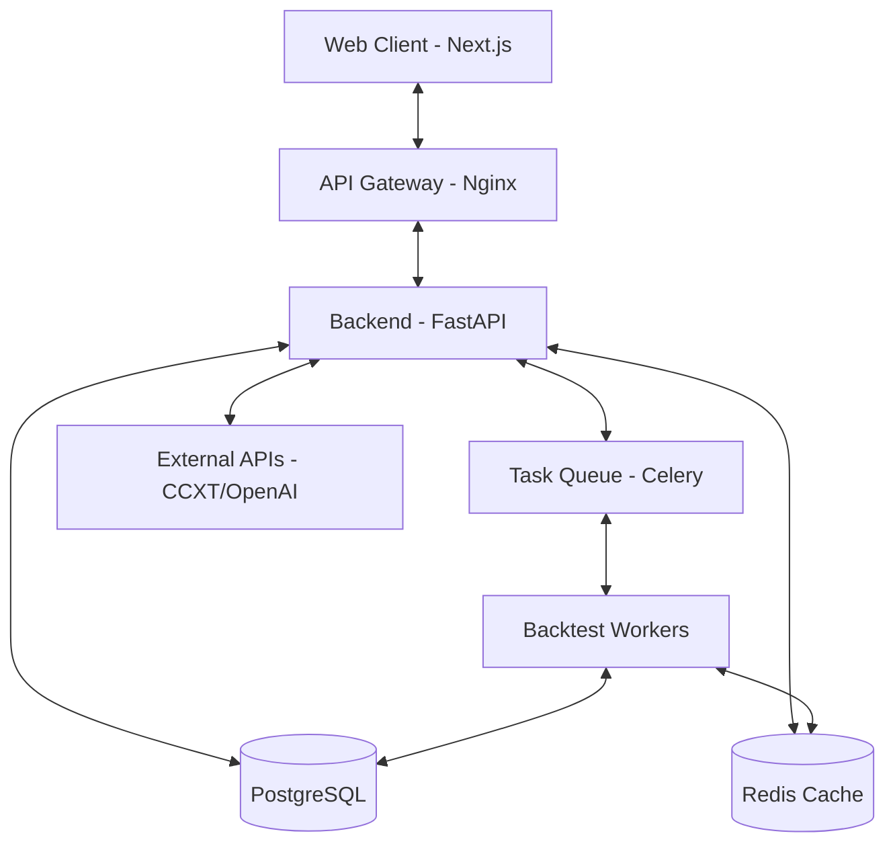

# EdgeArena — Competitive Trading Platform


EdgeArena is a high-performance, professional-grade platform designed for algorithmic traders to build, test, and compete. It combines a robust Python-based quantitative engine with a sleek, modern React frontend to provide a seamless trading experience.

---

## Core Features

*   **Strategy Management**: Create, version, and refine trading strategies using an extensible schema.
*   **High-Performance Backtesting**: Parallelized backtesting engine using Celery and Redis to validate strategies against historical candle data.
*   **Global Tournaments**: Compete against other traders in real-time or scheduled tournaments to climb the leaderboard.
*   **Strategy Marketplace**: Buy, sell, or license high-performing strategies in a secure, audited environment.
*   **Advanced Analytics**: Real-time charts powered by TradingView's Lightweight Charts and quantitative metrics (Sharpe ratio, drawdown, etc.).
*   **Enterprise Auth & RBAC**: Secure JWT authentication with fine-grained Role-Based Access Control.

---

## Technical Architecture



### Frontend Stack
- **Framework**: [Next.js 14](https://nextjs.org/) (App Router)
- **Styling**: [Tailwind CSS](https://tailwindcss.com/) + [Radix UI](https://www.radix-ui.com/)
- **State Management**: [Zustand](https://github.com/pmndrs/zustand) & [TanStack Query](https://tanstack.com/query/latest)
- **Charts**: [Lightweight Charts](https://www.tradingview.com/lightweight-charts/)
- **Validation**: [Zod](https://zod.dev/) + [React Hook Form](https://react-hook-form.com/)

### Backend Stack
- **Framework**: [FastAPI](https://fastapi.tiangolo.com/) (Python 3.11+)
- **ORM**: [SQLAlchemy 2.0](https://www.sqlalchemy.org/) (Async)
- **Migrations**: [Alembic](https://alembic.sqlalchemy.org/)
- **Background Jobs**: [Celery](https://docs.celeryq.dev/) + [Redis](https://redis.io/)
- **Trading Tools**: [CCXT](https://ccxt.com/), [Pandas](https://pandas.pydata.org/), [NumPy](https://numpy.org/)
- **AI Integration**: [OpenAI SDK](https://github.com/openai/openai-python)

---

## Project Structure

```text
edge-arena/
├── apps/
│   ├── api/                # FastAPI Backend Service
│   │   ├── app/            # Core application logic
│   │   ├── alembic/        # Database migrations
│   │   └── tests/          # Pytest suite
│   └── web/                # Next.js Frontend Application
│       ├── src/app/        # App Router pages & layouts
│       └── src/components/ # Reusable UI components
├── packages/
│   ├── shared-types/       # Common TypeScript definitions
│   └── strategy-schema/    # JSON schema for strategy validation
├── infra/                  # Infrastructure configurations
│   ├── docker-compose.yml  # Local orchestration
│   └── nginx/              # Proxy configurations
└── turbo.json              # Turborepo configuration
```

---

## Getting Started

### Prerequisites
- **Node.js** v20+ & **pnpm**
- **Python** 3.11+
- **Docker** & **Docker Compose**

### Installation

1. **Clone the repository**:
    ```bash
    git clone https://github.com/your-org/edge-arena.git
    cd edge-arena
    ```

2. **Install dependencies**:
    ```bash
    pnpm install
    ```

3.  **Setup Environment**:
    Copy `.env.example` to `.env` in both `apps/api` and `apps/web`.
    ```bash
    cp apps/api/.env.example apps/api/.env
    cp apps/web/.env.example apps/web/.env
    ```

4. **Spin up Infrastructure**:
    ```bash
    docker-compose -f infra/docker-compose.yml up -d
    ```

5. **Run Development Servers**:
    ```bash
    pnpm dev
    ```
    - Frontend: [http://localhost:3001](http://localhost:3001)
    - Backend API: [http://localhost:8000](http://localhost:8000)
    - Documentation: [http://localhost:8000/docs](http://localhost:8000/docs)

---

## Development Tasks

| Command | Description |
| :--- | :--- |
| `pnpm dev` | Start all services in development mode |
| `pnpm build` | Build all services for production |
| `pnpm lint` | Run ESLint and Ruff |
| `pnpm typecheck` | Run TypeScript validation |
| `pnpm db:migrate` | Apply latest database migrations |
| `pnpm db:seed` | Seed the database with sample data |

---

## License
© 2026 EdgeArena. All rights reserved.
